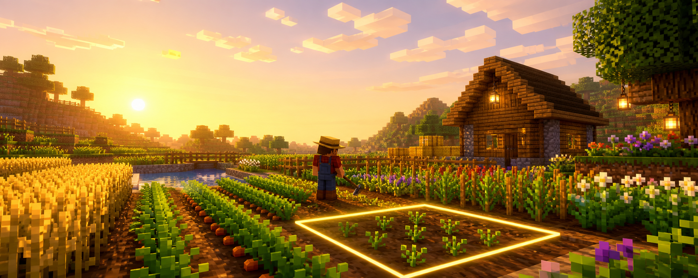

<p align="center">
  
</p>

<h1 align="center">Farm Tweaks</h1>

<p align="center">
  <strong>Faster, friendlier farming that still feels like vanilla Minecraft.</strong><br>
  Right-click to harvest. Work fields with better hoes. Plant more with Seed Bags.
</p>

<p align="center">
  <a href="https://github.com/Sijan079/FarmTweaks/releases"></a>
  <a href="https://github.com/Sijan079/FarmTweaks"></a>
  <a href="https://neoforged.net/"></a>
</p>

> [!NOTE]
> Farm Tweaks is currently for **Minecraft Java 1.21.1** with **NeoForge 21.1.219**.

## Make your farm flow

| Harvest in one motion | Shape a field faster | Plant at scale |
| :---: | :---: | :---: |
| Right-click a mature crop to harvest and replant it. Connected crops can be gathered with a hoe. | Each hoe tier has a practical tilling footprint, with a visible boundary before you commit. | Seed Bags hold one plantable type and fill a charged area with a bright perimeter preview. |

### Harvest without the replanting chore

Right-click mature crops to harvest them while keeping the field growing. Hoe harvesting can spread through connected crops, and Efficiency raises its harvest budget.

- Crop XP and Fortune behavior are kept crop-specific instead of applying a blanket multiplier.
- Sugar cane keeps its base planted; harvest an upper stalk to collect it and every segment above it.
- Sweet berry bushes yield berries and regrow; cocoa replants itself after harvest.
- Sneak when you need a single, precise harvest.

### Put every hoe to work

Hold a hoe and press **Ctrl + scroll** to cycle its mode. Scroll down moves forward; scroll up moves backward.

| Mode | What it does |
| --- | --- |
| **Till** | Tills the displayed area. |
| **Untill** | Deliberately returns farmland in the displayed area to dirt. |
| **Harvest** | Keeps the hoe in harvest mode and suppresses its tilling action. |

Hoe tier determines the centered field size: Wood **1×1**, Stone **3×3**, Iron/Gold **5×5**, Diamond **7×7**, and Netherite **9×9** by default. Sneaking always limits the action to the targeted block. Farm Tweaks can also prevent farmland trampling while preserving normal dehydration and blocked-above reversion.

Hold a Seed Bag and use **Ctrl + scroll** to choose square or radial planting for that individual bag. The selected shape is saved on the bag.

### Grow more than food

Cultivate vanilla small flowers alongside your regular crops, or build a pumpkin loop that is easier to use in a working farm:

- Pumpkins drop Fortune-affected Pumpkin Slices unless harvested with Silk Touch.
- Craft 1 slice into a pumpkin seed, 2 slices with sugar and an egg into pumpkin pie, or 9 slices into a pumpkin block.
- When Farmer's Delight is present, Farm Tweaks uses its Pumpkin Slice; it remains an optional integration.

## Install

1. Install **Minecraft Java 1.21.1** and **NeoForge 21.1.219**.
2. Download the matching Farm Tweaks JAR from [GitHub Releases](https://github.com/Sijan079/FarmTweaks/releases).
3. Place the JAR in your instance's `mods` folder and launch the game.

Farm Tweaks is designed for servers and clients using the same mod version. Optional integrations such as Cloth Config and Serene Seasons remain optional.

## Configuration and compatibility

The shared gameplay configuration is `config/farmtweaks.toml`; it includes harvesting, pumpkin recipes and drops, hoe actions, tiered tilling ranges, Seed Bags, farmland trampling, hydration, flowers, and crop XP. Client preferences such as the mode HUD, Ctrl+scroll switching, and scroll inversion live in `config/farmtweaks-client.toml`. If Cloth Config is installed, Farm Tweaks adds an in-game configuration screen with dedicated Hoe Actions and Controls tabs.

Datapacks can extend behavior through Farm Tweaks tags for seed-like items, Seed Bag plantables, and generic right-click-harvestable crops.

## In development

Farm Tweaks is actively evolving. Browse the [open roadmap issues](https://github.com/Sijan079/FarmTweaks/issues) or see the code-oriented [feature inventory](docs/features/feature-inventory.md). Player-facing release notes live in [CHANGELOG.md](CHANGELOG.md).

<details>
<summary><strong>For contributors</strong></summary>

<br>

This is a NeoForge 1.21.1 mod built with Gradle and Java 21.

```powershell
.\gradlew.bat build       # Run the standard validation build
.\gradlew.bat runClient   # Launch a development client
.\gradlew.bat runGameTestServer # Run NeoForge GameTests
```

Key project locations:

```text
src/main/java/com/sncial/farmtweaks/  # Common mod code
src/main/resources/                   # Assets, recipes, tags, and metadata
src/test/java/com/sncial/farmtweaks/  # Unit tests
docs/                                 # Feature notes and testing checklists
```
</details>

## License

All Rights Reserved. See `gradle.properties` for the current project metadata.
